# EcoOptimize

Plateforme IoT distribuée pour la surveillance et l'optimisation en temps
réel de la production, la distribution et la consommation d'énergie verte
à partir d'un réseau de capteurs connectés.

Ce projet a été initialement conceptualisé dans le cadre du **Challenge App
Afrique** (RFI). Cette version en fait une réalisation concrète et
fonctionnelle, pensée en lien avec les thématiques du **Master 1 Computer
and Network Systems** (Université Paris-Saclay) : systèmes distribués,
tolérance aux pannes, administration réseau, technologies logicielles
(Docker, MQTT, API REST).

## Démo



Le tableau de bord (`scripts/watch.py`) interrogeant l'API en direct :
production/consommation totales, état de chaque noeud, alertes de surcharge
et suggestions de répartition entre noeuds.

## Architecture

```
[simulateur Python] --MQTT--> [broker Mosquitto] --MQTT--> [backend Node.js]
     (4 noeuds simulés,                                          |
      pannes/pics aléatoires)                          stocke dans MySQL
                                                                   |
                                                          détecte les surcharges
                                                          et propose une répartition
                                                          (src/optimizer.js)
                                                                   |
                                                           expose une API REST
                                                              /       \
                                                  scripts/watch.py   app Flutter
                                                  (terminal, démo)   (mobile)
```

| Dossier | Rôle |
|---|---|
| `simulator/` | Simule plusieurs noeuds (sites de production/consommation d'énergie), publie des mesures périodiques via MQTT, avec pannes et pics de charge aléatoires |
| `broker/` | Configuration Mosquitto (broker MQTT, utilisé par Docker) |
| `backend/` | Microservice Node.js : ingestion MQTT, persistance MySQL, détection de surcharge + suggestions de répartition, API REST |
| `docker-compose.yml` | Orchestration complète (broker + MySQL + backend + simulateur) |
| `scripts/` | Outils de dev : lancer le stack sans Docker, afficher les données en direct |
| `demo/` | Enregistrement de démo (asciicast + SVG animé) |

L'application mobile Flutter (dashboard + historique par noeud) qui
consomme cette API vit dans un repo séparé : `ecooptimize_mobile`.

## API REST

| Route | Description |
|---|---|
| `GET /health` | État du service (connexion MQTT, base de données) |
| `GET /api/nodes` | Dernier état connu de chaque noeud |
| `GET /api/nodes/:id/history?limit=100` | Historique d'un noeud |
| `GET /api/alerts` | Alertes récentes (surcharge, noeud hors ligne) |
| `GET /api/summary` | Production/consommation totales + suggestions de répartition entre noeuds |

## Lancer le projet

### Avec Docker (stack complète : Mosquitto + MySQL)

```bash
docker compose up --build
curl http://localhost:4000/api/summary
```

### Sans Docker (développement rapide)

Un broker MQTT embarqué + stockage en mémoire, pour itérer vite sans
dépendance externe :

```bash
./scripts/dev_up.sh      # démarre broker + backend + simulateur
./scripts/watch.py       # tableau de bord en direct dans le terminal
./scripts/dev_down.sh    # arrête tout
```

## Résilience

- **Tolérance aux pannes des noeuds** : le simulateur fait passer aléatoirement
  des noeuds hors ligne ; le backend le détecte et le signale (`node_offline`)
  sans planter.
- **Debounce des alertes** : une alerte n'est notifiée qu'au changement d'état
  (ex. passage en surcharge), pas à chaque message MQTT, pour éviter le bruit.
- **Résilience de l'API** : `/api/summary`, `/api/nodes` et `/api/alerts` sont
  interrogés indépendamment côté client — l'échec d'un seul endpoint n'empêche
  pas d'afficher les autres.

## Reproduire la démo

```bash
pip install asciinema
./scripts/dev_up.sh
asciinema rec -c "python3 scripts/watch.py --interval 3 --duration 20" demo/demo.cast
npx svg-term-cli --in demo/demo.cast --out demo/demo.svg --window --no-cursor
```

## Prochaines étapes

- Tests automatisés sur la logique de l'optimiseur (`src/optimizer.js`)
- CI GitHub Actions (lint + tests à chaque push)
- Déploiement avec un vrai mécanisme de tolérance aux pannes (réplication,
  health checks Docker)
